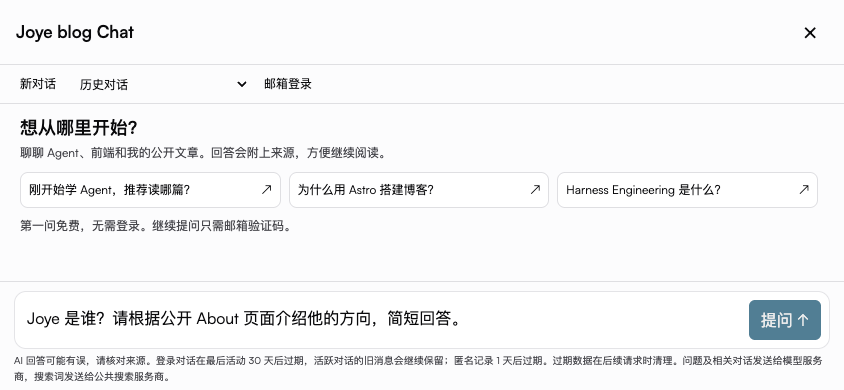
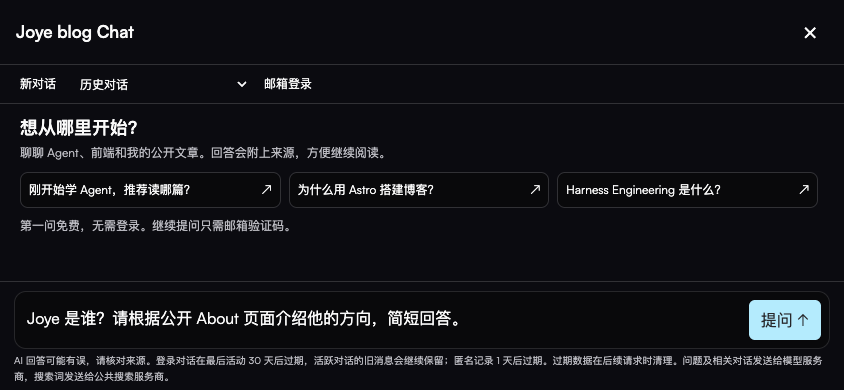
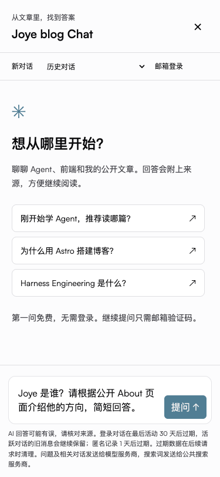
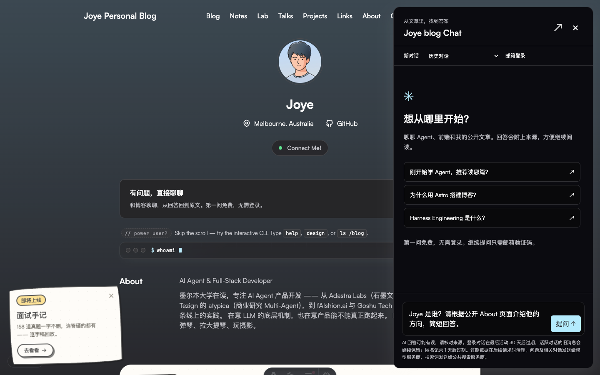

# Joye blog Chat — release handoff

Status: draft PR [#150](https://github.com/joyehuang/blog/pull/150). Production launch
requires isolated database and server secrets, including TinyFish, plus user-owned
QQ/163 deliverability checks. Actual agent inbox receipt is independently VERIFIED
by the acceptance agent using mail list/read. No further email was sent in rework1.
No production configuration, services, deployment or DNS were changed.

## Architecture and public capability

The Astro React island opens a native modal panel, expandable on desktop and
fullscreen on touch/coarse-pointer devices or narrow screens. Header, homepage,
article and terminal CTAs share it. The terminal's commands remain available only
when `eligibility.ts` permits width ≥641px AND primary fine pointer AND hover.
SSR defaults closed. Hydration, header, backtick/custom events, shell commands,
active-mode capability changes and matrix portals follow that same policy.
Touch landscape remains Chat-only. Short viewports get a compact composer.

The same-origin POST `/api/chat` endpoint runs in Vercel Node 22 with a pooled
PostgreSQL connection. The function allows 60 seconds; generation has a 45-second
deadline, leaving time for persistence (database statement timeout: eight seconds).
Build with Node 22; the installed adapter emits an unsupported fallback under
local Node 24. No package-manager change: this repository still uses Bun.

The request-isolated public agent calls the supported public Command Code endpoint
`https://api.commandcode.ai/provider/v1/chat/completions`, independently pinned to
`deepseek/deepseek-v4-flash`. It never contacts the Mac proxy, reads QQ live model
selection or falls back to another model/provider. See the official
[Provider API documentation](https://commandcode.ai/docs/provider).

Each agent run makes at most two model calls: tool planning (600 output tokens)
and streaming synthesis (1,200 output tokens). It executes at most two calls to
`corpus_search` or `web_search`. Command Code rejected forced `tool_choice:
required` for this model; planning uses supported `auto`, requires a valid tool
plan before proceeding, and synthesis uses `none`. Invalid/prohibited tools or
excess calls terminate the run. Reasoning fragments needed for protocol continuity
stay in the current request; they are never streamed or saved in conversations.
Context is capped at six history turns and 60,000 serialized characters. Up to
twelve source records are retained, with bounded excerpts.

This small public tool loop avoids coding-session resource loading, agent home
directories and extensions on Vercel. The pi SDK/security documentation was read;
there is no need to instantiate its local coding runtime. Public retrieval and web
search are implemented as real tools, not a single plain completion.

Provenance: the Latin/CJK tokenizer adapts QQ `src/tools/corpus-search.ts`; the
fixed-host TinyFish adapter and public tool descriptions adapt
`src/tools/tinyfish.ts` and `src/tools/index.ts`. Public persona behavior adapts
`persona.ts` and the retrieval-first orchestration in `brain.ts`. All were inspected
READ ONLY on 2026-09-06. These are adapted public capabilities with no runtime QQ
imports, shared mutable flags, QQ histories, private corpus or administrative code.

The snapshot contains 56 documents fetched only from published blog/notes/talks/
curated APIs and rendered About/Projects pages. The sync script never reads local
content repositories. Referential follow-ups use source metadata from the
owner-validated reservation transaction. Prior site URLs must still match the
public snapshot; web excerpts come only from stored retrieved metadata. New topics
retrieve independently. URLs in user/model prose are never source authority.

`web_search` calls only `https://api.search.tinyfish.ai/` with an encoded query,
redirects disabled, a 10-second timeout and a 160 KB response limit. Each tool
returns at most four public HTTPS results with 1,200-character excerpts. Local/IP/
credential-bearing links and unsafe protocols are rejected. No result-selected
host is fetched by the application, preventing result-driven SSRF. Markdown
rejects raw HTML/images and links only to validated source metadata. Search
outages produce a visible notice and explicit tool error, never invented results.

## Identity, quotas and retention

Signed HttpOnly SameSite cookies identify anonymous sessions. Origin/CSRF checks,
secure production cookies and hashed IP abuse controls protect the endpoint.
PostgreSQL serializes short state transitions with a row lock; no external I/O
occurs under that lock. First question entitlement is enforced atomically, across
refreshes and parallel requests. First nonempty output is persisted before it is
streamed. Unanswered failures release entitlement; partial delivered answers count.
Attempts still consume budget. A 65-second lease recovers crashed requests.

- Two concurrent agent runs globally; one pending run per owner or IP.
- 100 agent attempts/day globally, 10/IP and 20/owner. Each permits at most two
  model calls and two public tool calls, not an unlimited loop.
- 30 question attempts/hour/IP; 40 session calls/hour/IP.
- One anonymous answered question/day/IP plus signed-cookie entitlement.
- OTP: five sends/hour/session, three/hour/email, 10/day/IP, 30/day globally;
  60-second cooldown, ten-minute TTL, five attempts/challenge, 20 verifies/hour/IP.
- Six prior answered turns in context; 100 answered turns/conversation.

Email OTP accepts normal domains including QQ/163. Successful single-use
verification rotates the session and migrates only its anonymous conversations.
No email/account identifiers are added to model context. Authenticated users can
resume their own conversations. Logout revokes the current session; account deletion
removes account/email/sessions/conversations. Conversation deletion does not reset
entitlement. Short-lived abuse counters survive deletion until expiry.

Signed-in conversations expire after **30 days of inactivity** (`updated_at`),
not 30 days per turn. Older turns remain in active conversations. Anonymous
sessions/chats expire after one day. Expiry is enforced before every API action;
physical cleanup is lazy, so an idle deployment retains expired rows until the
next request. UI wording explicitly states this. Backup retention is the operator's
responsibility. If strict physical cleanup is needed, schedule the following SQL
in the database before launch; this task did not create a production scheduler.

```sql
DELETE FROM blog_chat_conversations WHERE updated_at < now() - interval '30 days';
DELETE FROM blog_chat_conversations WHERE owner IN (
  SELECT id FROM blog_chat_sessions WHERE account_id IS NULL AND expires_at < now()
);
DELETE FROM blog_chat_sessions WHERE expires_at < now();
DELETE FROM blog_chat_otp WHERE expires_at < now();
DELETE FROM blog_chat_limits WHERE expires_at < now();
```

Internal IDs, usage, latency/status and quotas stay in backend observability.
Vercel Analytics is the sole analytics service; `ANALYTICS.md` defines safe enum
payloads without questions, email, account identifiers or raw commands. Source
clicks use the existing `other` bucket for web results; no new PII properties.

## Launch/configuration checklist

1. Select an isolated PostgreSQL/Neon branch and least-privilege application role.
   Explicitly apply `scripts/chat/schema.sql`; grant only necessary chat table DML
   and function EXECUTE. Use a pooled TLS connection; do not reuse unrelated data.
2. `environment.names` lists names only. Set server-only `CHAT_DATABASE_URL`,
   `CHAT_COOKIE_SECRET` (≥32 random characters), `CHAT_CC_KEY`, `CHAT_TINYFISH_KEY`,
   `CHAT_RESEND_KEY`, `CHAT_EMAIL_FROM` and exact `CHAT_ORIGIN`. Local values belong
   under `~/.config` in mode0600 files. There is no production file fallback.
3. Confirm provider terms, sender SPF/DKIM and spending alerts. Existing authorized
   keys suffice for bounded tests; no subscription or paid infrastructure was added.
4. Agent inbox receipt is verified. QQ/163 actual inbox receipt is UNVERIFIED;
   test only user-owned addresses when supplied, including spam folders. Provider
   acceptance is not inbox receipt. Do not invent recipients.
5. Build under Node22; check emitted `nodejs22.x`, streaming and 60-second duration.
6. Enable `CHAT_ENABLED` only after configuration. Preview additionally requires
   `CHAT_PREVIEW_ENABLED`, its own isolated database and exact HTTPS origin.
   Unconfigured deployments fail closed; inherited previews remain protected.
7. Decide physical cleanup/backup retention and verify deletion. Confirm Vercel
   IP-header behavior and safe analytics receipt after separately authorized launch.
8. Review the staged `announcement-draft.md`; do not publish/send before launch
   authorization. No production merge/deploy is part of this PR.

## Reproduce without secrets

Run `bun install --frozen-lockfile`, `bun test`, `bun run check`, and `bun run build`
under Node22. PGlite tests execute real SQL; model/network doubles are explicit and
confined to tests. With no configuration, the UI works and `/api/chat` returns503.
No credentials, model calls or email are needed for these deterministic checks.

For authorized local integration, use a dedicated loopback PostgreSQL instance
and mode0600 JSON config under `~/.config`. Run `bun scripts/chat/dev.ts <config>`
and `bun scripts/chat/verify-postgres.ts <config>`. The existing local test cluster
must be started with `pg_ctl -D ~/.config/blog-agent-chat-test/pgdata -o '-h
127.0.0.1 -p 55439' start`; never use default5432. Stop both test servers afterward.

`bun scripts/chat/sync-corpus.ts` refreshes only actual public content. Review its
diff. It rejects unexpected origins/redirects and missing public pages.

## Future boundary

Verified QQ identity binding requires an expiring server-verified challenge,
explicit import consent and separate public/private data audit. Self-claimed QQ
IDs cannot establish ownership. No QQ import/binding endpoint exists here.

## Validation

Original release validation covered SQL OTP abuse, quotas/races, ownership,
migration/deletion, Markdown safety, stream cancellation/errors, safe analytics,
real PostgreSQL eight-connection concurrency, email login, and browser flows.
Rework adds contextual/cold/resumed source isolation, topic switches, bounded
public-tool execution, web URL safety, inactivity retention, and mobile landscape
capability/resize/portal checks. See the local handoff for current exact results.

A real rework public-agent smoke completed in 7,595ms: two model calls, two web
search calls, 1,841 input /382 output tokens. Two initial compatibility requests
were rejected for forced tool selection; no model fallback was used. No further
email was sent. Screenshots and sanitized evidence are retained locally.

Rework deterministic validation: **55 tests /463 assertions**, Astro check **zero
errors/warnings** (two pre-existing hints), and eight real PostgreSQL connections
with exactly one winner. Mobile375 and touch844×390 reject header clicks,
backtick and both entry events; desktop1440 fine/hover permits entry and exits
when capability changes. Active matrix portal removal also passed. Landscape
email input and send/cancel controls are reachable without horizontal overflow.





