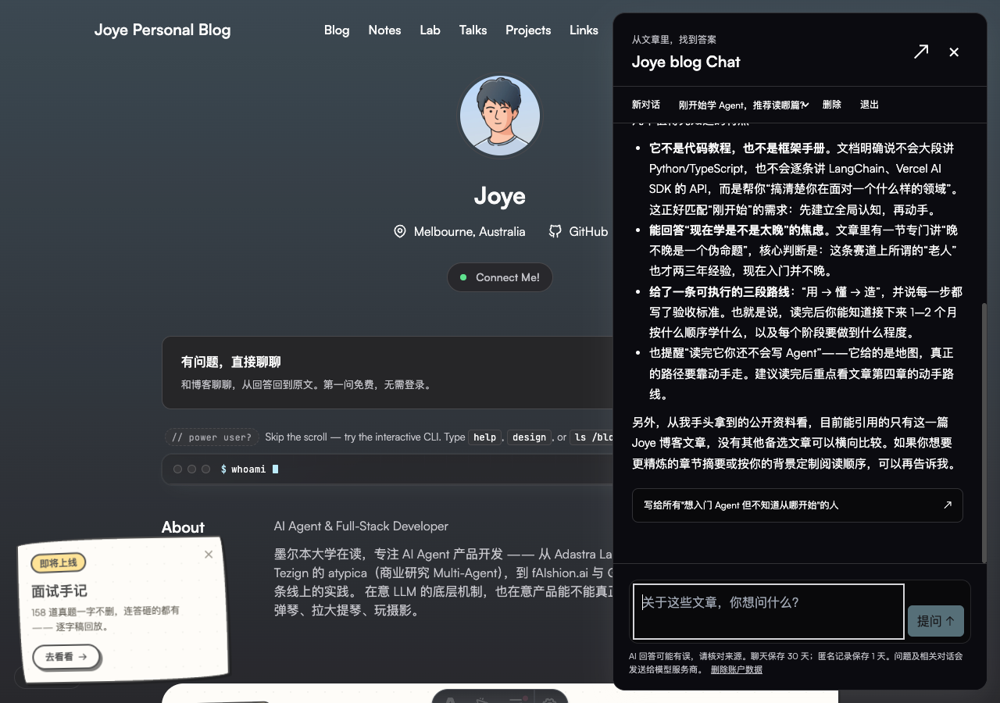
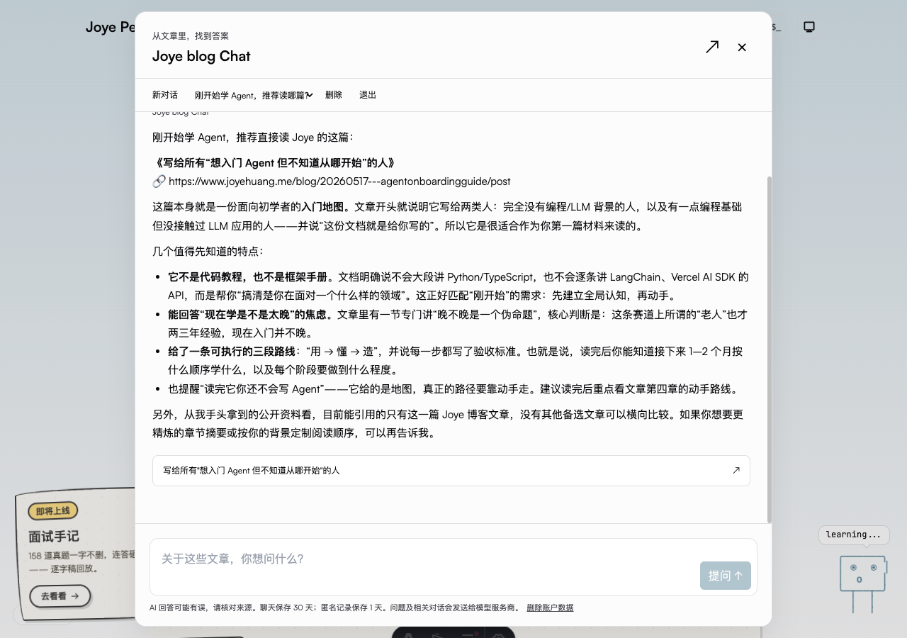
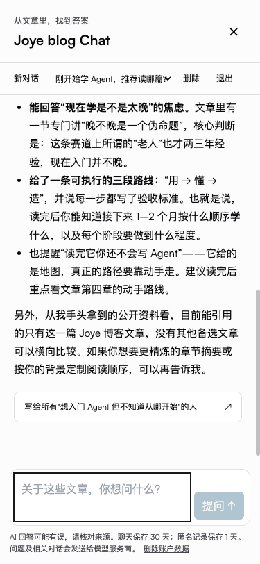
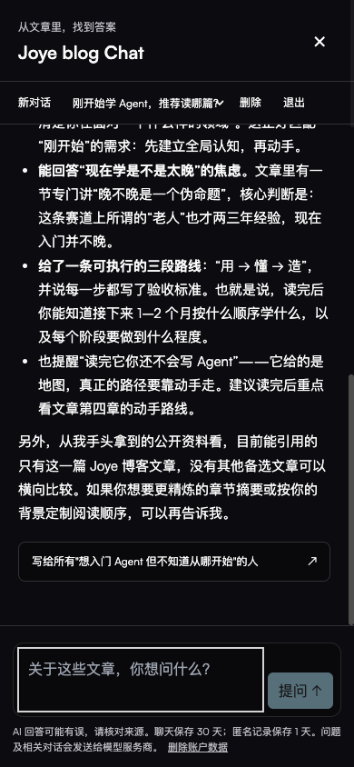

# Joye blog Chat — release handoff

Status: implemented; **production launch is blocked on isolated database/secrets
configuration and inbox delivery checks**. This branch does not deploy production.
Chat's API returns a safe 503 unless explicitly enabled. An inherited preview is
also disabled unless separately enabled with its own configuration.

## Architecture and boundaries

An Astro React island supplies a native modal conversation panel, expandable on
desktop and fullscreen at 640px and below. Header, homepage, article and terminal
entry points share it. The desktop terminal keeps its existing commands; `chat`
opens the panel with an editable draft. Mobile suppresses both terminal render
and keyboard/custom-event entry, including after resizing from desktop.

The same-origin Astro `/api/chat` POST endpoint runs on Vercel Node 22. A pooled
PostgreSQL connection (Neon pooled connection string is suitable) handles all
state. The adapter emits a streaming function with `maxDuration: 60`. The model
request has a 45-second deadline, leaving time for persistence. The database
statement timeout is eight seconds. Vercel must build using the repository's
`engines.node: 22.x`; an older adapter can emit an unsupported fallback when
building locally under Node 24. Use Node 22 for release builds.

The upstream is `https://api.commandcode.ai/provider/v1/chat/completions`, with
`deepseek/deepseek-v4-flash` pinned in code. This was derived from the existing
Command Code provider/proxy mapping, then exercised directly. No Mac proxy,
fallback provider, mutable QQ model selection or host service is involved.
Each call is capped at 1,800 output tokens, six history turns and six 1,200-character
public excerpts. There are no model-callable tools, shell, filesystem, web fetch,
admin actions or personal-agent resources. No pi coding session is instantiated:
its resource loader and local coding permissions are unnecessary for this bounded
retrieval use case. The pi SDK/security documentation was inspected before making
that decision.

The Latin/CJK tokenizer adapts the algorithm in Joye's QQ bot
`src/tools/corpus-search.ts`, inspected read-only on 2026-09-06. No QQ runtime
imports, persona, state flags, corpus files, transcripts or admin code were copied.
The web persona is independently written. Public corpus snapshots are fetched
only from the live site's public knowledge API. The sync command refuses external
origins and redirects and never reads another checkout. Source titles and canonical
paths come from that metadata. Each document contributes at most two excerpts.
Both source cards and Markdown links are checked; Markdown links must also occur
in the retrieved source cards. Raw HTML and image embedding are disabled.

## Persistence, authentication and spending limits

`scripts/chat/schema.sql` defines accounts, signed-session backing records,
conversations, turns, OTP challenges and rate counters. A short locked singleton
row serializes state transitions, including anonymous quota admission, OTP
consumption and migration. Network calls happen after the database transaction
commits. This deliberately favors easy auditing over high throughput for the
first, low-volume release. There is no process-local authorization state.

Cookies are HMAC-signed, HttpOnly, SameSite=Strict, path-scoped and Secure outside
explicit loopback development. POST requires exact configured Origin, same-origin
request URL and JSON. The body is limited to 10 KB and questions to 2,000 characters.
On Vercel only the platform-controlled `x-vercel-forwarded-for` is used for IP
rate keys; arbitrary `x-forwarded-for` is not accepted. IP and email rate keys
are HMAC-derived and never sent to analytics.

Only the first answered anonymous question is free. A pending lease blocks
parallel questions from that owner or IP. The first nonempty answer is durably
marked before it is streamed, consuming entitlement. Empty/failed attempts can
retry without losing the free answer; upstream attempts still consume spending
limits. A stopped partial answer counts as answered. A process crash leaves a
65-second lease; stale unanswered leases recover on the next request. A delivered
partial answer remains consumed even after a crash. Saving or delivery failure
is reported; a client disconnect aborts generation. A hard serverless termination
may retain just the first saved fragment, marked interrupted after lease expiry.

Initial hard limits (change deliberately in SQL, with tests):

- Two concurrent model calls globally; one pending call per owner or IP.
- 100 upstream attempts per rolling day globally, 10 per IP and 20 per owner.
- 30 question attempts/hour/IP and 40 new-session calls/hour/IP.
- One anonymous answered question/day/IP, in addition to cookie entitlement.
- Five OTP sends/hour/session, three/hour/email, 10/day/IP, 30/day globally.
- 60-second resend cooldown, 10-minute code TTL, five attempts/challenge and
  20 verification attempts/hour/IP. Codes are HMAC hashes in the database.
- Six prior answered turns in model context, 100 answered turns/conversation.

OTP accepts normal email domains including QQ and 163. Sign-in rotates the session,
consumes the challenge once and migrates only conversations owned by the
anonymous session. Existing account conversations cannot be moved by switching
accounts. No email/account identifiers enter model context. New sessions can
resume the account's saved conversations. Logout revokes the current session;
account deletion removes the account, email, every session and owned conversations.
Conversation deletion does not reset free entitlement. Short-lived abuse counters
remain until expiration, including after deletion, to prevent quota resets.

Chats expire after 30 days; anonymous sessions/chats after one day. Expired data
is excluded/removed on the next chat API action. Physical cleanup is lazy, so a
completely idle deployment can retain expired rows until traffic resumes. Operators
requiring a strict physical-deletion deadline should schedule the SQL cleanup
below daily in the database before launch. Database backup retention remains an
operator/provider responsibility. No analytics identifiers are stored with chats.

```sql
DELETE FROM blog_chat_conversations WHERE updated_at < now() - interval '30 days';
DELETE FROM blog_chat_conversations WHERE owner IN (
  SELECT id FROM blog_chat_sessions WHERE account_id IS NULL AND expires_at < now()
);
DELETE FROM blog_chat_sessions WHERE expires_at < now();
DELETE FROM blog_chat_otp WHERE expires_at < now();
DELETE FROM blog_chat_limits WHERE expires_at < now();
```

The database records internal owner/turn IDs, attempt counts, completion status,
input/output usage and latency. These are private operational records. The API
returns stable error buckets, never raw provider/database errors. The Vercel-only
funnel contract is in `ANALYTICS.md`; payloads use explicit enum allowlists.
The pre-existing Umami script was removed to comply with that contract.

## Configuration and launch checklist

`environment.names` lists names only. Never commit filled-in env files. Keep local
configuration under `~/.config` with mode 0600; pass production values through the
hosting platform's server-only secret configuration during a separately authorized
launch. This release does not modify production environments.

1. Create/select an **isolated** PostgreSQL database/Neon branch and least-privilege
   application role. Do not reuse the signup board database implicitly. Apply
   `scripts/chat/schema.sql` explicitly using the deployment owner. The function
   uses invoker privileges; grant the application role only the needed chat table
   DML and EXECUTE on `blog_chat_action`/`blog_chat_limit`, with no access to other
   schemas. Use a pooled TLS connection string for Vercel.
2. Set `CHAT_DATABASE_URL`, a cryptographically random `CHAT_COOKIE_SECRET` of
   at least 32 characters, `CHAT_CC_KEY`, `CHAT_RESEND_KEY`, `CHAT_EMAIL_FROM` and
   exact `CHAT_ORIGIN`. The keys may be sourced from the existing authorized
   Command Code and Resend config files. There is no production file fallback.
3. Verify the chosen sender's outbound SPF/DKIM and review the provider's sending
   permissions and public website usage terms. Set sensible provider spending
   alerts in addition to the conservative server attempt caps. No paid
   infrastructure or subscription changes were made in this task.
4. Verify actual receipt and code entry at the authorized agent inbox, then at
   user-owned QQ and 163 inboxes. Check inbox and spam folders. Provider
   acceptance or `delivered` status is **not** inbox-receipt evidence.
5. Confirm Node 22 and a permitted 60-second function duration. Build with
   `bun run build:checked` under Node 22. Inspect the generated
   `.vercel/output/functions/_render.func/.vc-config.json`.
6. Enable `CHAT_ENABLED=true` only after database migration and secrets are ready.
   For a preview, additionally set `CHAT_PREVIEW_ENABLED=true`, use an isolated
   preview DB, and set its exact HTTPS origin. Unconfigured previews fail closed.
   Do not point preview at production chat data. Apply Vercel firewall/rate rules
   suitable for public launch and verify platform IP-header behavior in preview.
7. Choose and document backup retention, schedule physical cleanup if needed,
   and confirm delete-account behavior. Inspect Vercel Analytics event receipt
   after an authorized launch without logging questions or identifiers.
8. Review `announcement-draft.md`. Publish/send it only after launch authorization;
   it is staged documentation, not a scheduled or auto-published post.

References: [Vercel Node versions](https://vercel.com/docs/functions/runtimes/node-js/node-js-versions),
[Astro Vercel adapter](https://docs.astro.build/en/guides/integrations-guide/vercel/).

## Reproduce without secrets

Run `bun install --frozen-lockfile`, `bun test`, `bun run check`, then
`bun run build` under Node 22. Tests run the actual SQL functions in PGlite;
model/network test doubles are explicit and confined to tests. With no chat
configuration, `bun dev` displays the real UI and the API safely returns 503.
No key, email send or model call is required for these checks.

For a real local integration, initialize a dedicated loopback PostgreSQL instance,
apply the schema, and put real configuration in a mode-0600 JSON file under
`~/.config`. `bun scripts/chat/dev.ts <config-file>` starts the existing Astro dev
command with that server environment. `bun scripts/chat/verify-postgres.ts
<config-file>` runs eight parallel connections against a loopback database only.
Stop that server and database when finished. No daemon configuration is needed.

`bun scripts/chat/sync-corpus.ts` refreshes the public snapshot explicitly and
fails on an empty result. Review the snapshot diff before committing. It is not
an automatic read of local private content or a live model fetch tool.

## Deferred extension boundary

QQ identity binding is a future feature. It would require a server-verified,
expiring challenge completed through the actual QQ identity, explicit import
consent and a separately audited data-selection boundary. A typed QQ ID must
never establish identity or grant access. No QQ binding/import endpoint exists
in this release.

## Validation recorded for this branch

- 44 Bun tests passed (385 assertions), including real SQL transition tests in
  PGlite, Markdown/XSS handling, stream cancellation/error handling, OTP limits,
  migration/deletion, identity separation and safe analytics.
- Eight simultaneous connections to a dedicated local PostgreSQL instance
  admitted exactly one anonymous question; failed-answer retry and second-question
  gating passed there too.
- Astro check: zero errors/warnings; two existing hints in unrelated scripts.
- Node 22 production build passed; emitted runtime is `nodejs22.x`, streaming
  enabled, `maxDuration: 60`.
- One real Command Code question completed: 4,376 input tokens, 827 output tokens,
  8,322 ms; the source-linked answer was persisted and resumed after login.
- One authorized email test reached Resend's `delivered` event. Sender-side code
  verification passed the browser login/migration flow. Actual inbox receipt,
  including QQ/163, remains UNVERIFIED.
- Desktop commands/Chat handoff, article CTA, mobile backtick/custom-event guards,
  account deletion, native dialog Escape/focus return and 375/390px overflow
  checks passed. Both themes and desktop expansion were checked. Qwen
  `vision_chat` reviewed the final scrolled screenshots and found no critical
  visual defects. Browser task space, local Astro server and temporary PostgreSQL
  server were closed after verification.

Screenshots (public article content and synthetic UI questions only):





