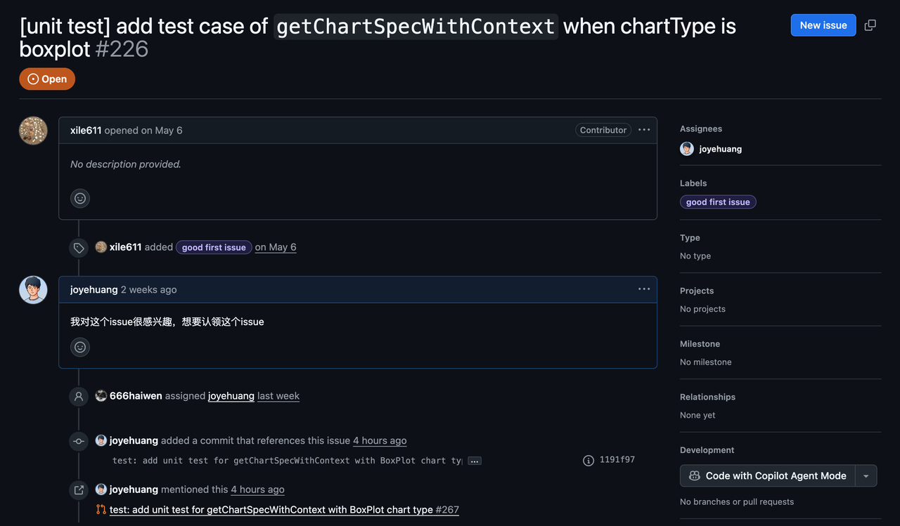
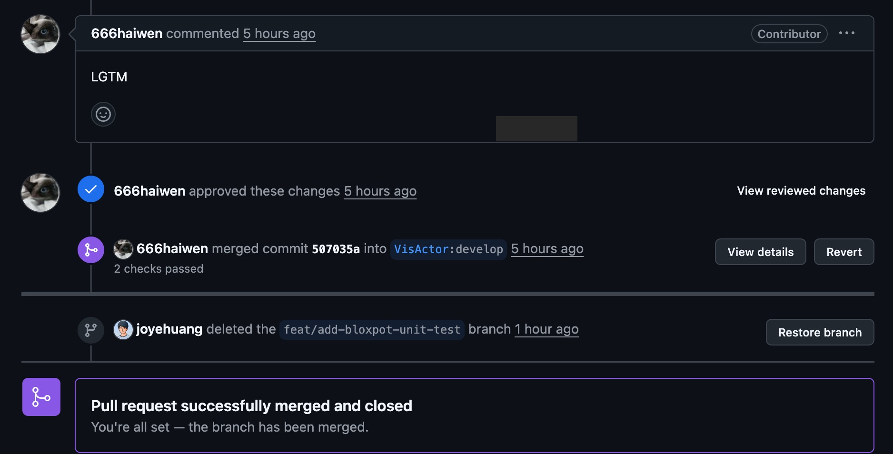

import { GithubCard } from 'astro-pure/advanced'

## Preface
On June 27, 2025, around 7 PM Melbourne time, I opened the first pull request of my life — for the VMind project in the VisActor community. It would be a lie to say that moment wasn't exciting. After all, in my mind, open source had always been something only seriously skilled people could do. I'd tried to break into open source before, but those attempts clearly failed. Maybe my approach was wrong, maybe my goals weren't clear enough, or maybe it was just my tendency to give up halfway.

## How I found this project
It was a lucky break, honestly. I discovered this open-source project through OSPP (and if the event hadn't been postponed, I probably wouldn't have applied at all). To be honest, I do have a bit of an aversion to high-difficulty tasks. At the time, I browsed every JavaScript project in this round of OSPP and noticed a few of the VisActor community's foundational projects. One of them was building a candlestick chart for VChart — I was really interested in it, so that same night I did some research and reached out to the mentor.
The reply, however, made it clear that all VisActor projects would be judged on cumulative contributions made during the OSPP registration window. In other words, someone like me, hoping to "snag a leftover spot" a week after the deadline, basically had no chance of being accepted. Still, the mentor's email included a QR code for the VisActor Contributors Group on Feishu, and I joined right away. As a newcomer, I didn't dare say much at first — mostly I just scrolled through the past chat history (Feishu keeps message history) and quietly learned.

<GithubCard repo='https://github.com/VisActor/VMind' />

## Picking an issue
I found the group's atmosphere incredibly welcoming. When someone wanted to claim an issue, they'd simply comment under the GitHub issue and give a heads-up in the Feishu group, and a core contributor or maintainer would respond. For someone like me, participating in open source for the first time, this was genuinely a great fit — it spared me a lot of the "nobody's responding" anxiety, and I could ask questions in the group anytime.
I went through the issue trackers of all four open-source projects in the VisActor community and found that VMind currently had mostly beginner-friendly unit-test tasks, many of them tagged "good first issue." Through AI and online searches, I also confirmed that writing unit tests really is a solid entry point into open source (along with non-coding tasks like fixing documentation).

## Getting started for real
I picked an issue and left a comment saying I wanted to claim it (later I confirmed it again in the Feishu group — everyone's busy, so I'd recommend just saying it in the group directly). From there it was the standard open-source contribution flow: fork the repo, clone it locally, set up the remote and upstream, then start studying the project code.
Since this was about writing unit tests, I first looked at the test folder and quickly found where I needed to add my test (and discovered the existing tests for other chart types). What I wrote this time was the test file for getChartSpecWithContext_boxplot — essentially adding BoxPlot-type tests for VMind's getChartSpecWithContext function, to verify the data-field mapping and chart-spec logic when AI generates charts.
At first my head really was spinning a bit (maybe I'm just too much of a noob), so I handed the issue to an AI and asked it to lay out the rough steps for me (plenty of small problems cropped up along the way, of course), along with the concepts I needed to grasp. For instance, this project uses Jest, so I had to go learn it (checking the official site, or a crash-course video on YouTube / Bilibili — a one-hour speedrun is plenty).
What I think you absolutely must do is read the test code already written in the project and learn how others write it. Even if everyone uses Jest, different projects still differ a bit. And the process of understanding someone else's code deepens your understanding of the project itself.
My first draft was actually modeled on the pie chart's test file — I then tweaked the data (which I found in the mockdata) and asked the AI to take a look at the problems. I'd specifically point out: **I don't need the answer directly; I just need you to point out the problems and the approach — I'll write the code myself.** I think this distinction matters a lot. AI can certainly handle simple test tasks, but if you let it, you won't learn a thing.
If you let AI generate complete, ready-to-use code, very few people would bother studying the reasoning behind each line. But writing it yourself means hitting pitfalls and debugging, and that process is enormously valuable for improving your skills — in any field.

## The PR gets merged
I posted in the Feishu group asking a contributor to review my work, and feedback came quickly: I'd written two pointless lines of code. After fixing that and pushing a new commit, my PR was successfully merged today (July 1, 2025)!

## Takeaways
This experience taught me a lot. First, I learned how to get started on an issue, including how to locate the corresponding spot and function within a project. In my case, I needed to find where to add the test file, the definition of the getChartSpecWithContext function, the core code for the BoxPlot chart (which defines the fields that needed testing), and the mockdata (which could be used directly for testing).
Once I'd found that code, I read and understood it, then extracted the parts I needed for the test. Second, I think imitation is a great friend of learning. Human learning often starts with imitation. My first draft was modeled on the pie chart's test — it had bugs (for instance, I used the pie spec but was testing a boxplot), but this "imitate and improve" process is important. Once you have a framework, asking an AI for help becomes more efficient too.
I also ran into the kind of small problems common to "big projects," like Node.js version incompatibility. That's when you need nvm to install and switch between multiple versions. And here's something amazing: once you claim an issue in an open-source project, you feel a powerful sense of responsibility — you genuinely want to do the job well.
So now I've gone and left a comment on another issue in this project, ready to keep contributing!

---
If you found this experience helpful, or you're thinking about giving open source a try yourself, consider following the VisActor community's projects or dropping by the group — maybe you'll find a "first time" of your own too.
