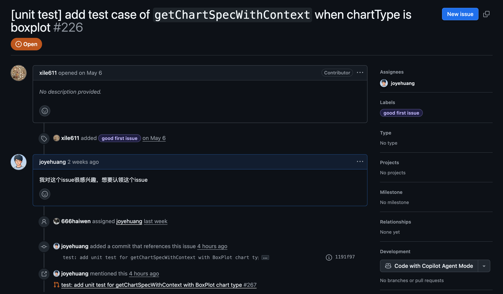
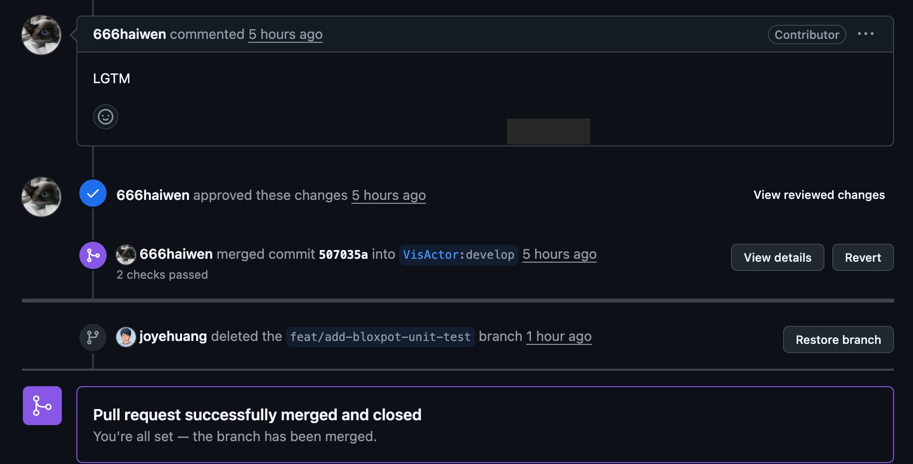

import { GithubCard } from 'astro-pure/advanced'

## 前言
2025年6月27号，墨尔本时间晚上7点左右，我给 VisActor 社区的 VMind 项目提了人生中的第一个 PR。说这一刻不兴奋是骗人的，毕竟在我心中，开源一直是一群非常厉害的人才能做的事。我以前也尝试过入门开源，但显然都失败了。也许是方法不对，也许是目标不明确，或者就是自己半途而废的心态使然。

## 如何找到这个项目
说来挺幸运的，我是通过 OSPP（如果这个活动没有延期，我大概也不会申请）发现这个开源项目的。老实说，我确实对挑战性高的任务有点抗拒。当时我浏览了这次 OSPP 中所有使用 JavaScript 的项目，注意到了几个 VisActor 社区的基础项目。其中一个是为 VChart 开发 K 线图，我对这个项目很感兴趣，于是当晚就做了一些调研并联系了 mentor。
不过回复中明确说明，VisActor 的所有项目都会以 OSPP 开放报名期间的累计贡献作为评判标准。换句话说，像我这种在截止后一周才想“捡漏”的人，基本不可能被录用。不过 mentor 的邮件里附带了 VisActor Contributors Group 的飞书群二维码，我立马就加群了。刚进群的我也不敢发言，主要是先翻看过往的聊天记录（飞书会保留历史消息），默默学习。

<GithubCard repo='https://github.com/VisActor/VMind' />

## 开始挑选issue
我发现群里的交流氛围非常友好。大家想要认领 Issue 时，直接在 GitHub Issue 下留言，并在飞书群里同步一下，就会有 core contributor 或者 maintainer 来响应。对于我这种第一次参与开源的人来说，这种方式真的很适合，省去了很多“没人搭理”的担忧，也可以随时在群里提问。
我查看了 VisActor 社区四个开源项目的 Issue 区，发现 VMind 目前大多是适合新手的 unit test 类型任务，很多也标记了 good first issue 标签。我也通过 AI 和网上搜索确认，写单元测试确实是一个不错的开源起点（当然，除了修文档这类非编码任务）。

## 正式上手
我挑选了一个 issue，并在下方留言表示我想认领（后来还是在飞书群里确认了一下，大家都挺忙的，建议还是直接在群里说）。接下来就是标准的开源贡献流程了：fork 仓库、clone 到本地、设置好 remote 和 upstream，然后开始研究项目代码。
因为是写单元测试，我首先查看了 test 文件夹，很快找到了我需要添加测试的位置（发现了其他图表类型已有的测试）。我这次写的是 getChartSpecWithContext_boxplot 的测试文件，主要是为 VMind 项目的 getChartSpecWithContext 函数添加 BoxPlot（箱形图）类型的测试，用于验证 AI 生成图表时的数据字段映射和图表规格逻辑。
一开始确实有点头皮发麻（也许我太菜了），于是我把 issue 丢给 AI，让它帮我梳理大致的步骤（中间当然会遇到不少小问题），还有我需要掌握的知识点。比如这个项目用了 Jest，那我就得去了解一下（看看官网或者 YouTube / B站上的 crash course 视频，一小时速通就足够了）。
我觉得一定要看的是项目中已经写好的测试代码，学习别人是怎么写的。哪怕都是用 Jest，不同项目还是有点区别的。而且理解他人代码的过程，本身也会加深对项目的理解。
我的初版代码，其实是模仿 pie chart 的测试文件写的，然后改一改数据（从 mockdata 中找到的），再请 AI 帮我看看问题。我会特别说明：**我不需要直接答案，只需要你指出问题和思路，代码我自己写。**我认为这个区别很重要。AI 的确可以搞定简单的测试任务，但那样你根本学不到东西。
如果让 AI 直接生成完整可用的代码，估计很少人会去研究每一行的来龙去脉。但自己写，就会踩坑、查错，这个过程对能力提升极其重要——不管在哪个领域都是如此。

## PR被Merged
我在飞书群里发了消息请 contributor 帮我 review，很快就收到反馈：我写了两行没意义的代码。改完之后重新 push 提交新的 commit，今天（2025年7月1日）我的 PR 被成功 merged 了！

## 收获
这次经历让我收获很多。首先是学会了如何上手一个 issue，包括在项目中找到对应的位置和函数。就我这次来说，需要找到测试文件添加的位置、getChartSpecWithContext 函数的定义、BoxPlot 图的核心代码（定义了需要测试的字段）、以及 mockdata（可直接用来测试的）。
找到这些代码后，阅读并理解，再提取出需要的部分用于测试。其次我觉得模仿是学习的好朋友。人类的学习很多时候就是从模仿开始的。我的初版代码就是模仿 pie chart 的测试写的，虽然有 bug，比如用了 pie 的 spec 但测试的是 boxplot，但这种“模仿+改进”的过程很重要。有了框架之后，再去找 AI 询问也会更高效。
另外还遇到一些“大项目”常见的小问题，比如 nodejs 版本不兼容。这时就需要用 nvm 来安装多个版本切换。还有一点很神奇，当你在开源项目认领了一个 issue，内心就会有一种强烈的责任感，真的很想把这件事做好。
所以我现在又去给这个项目下一个 issue 留言，准备继续贡献！

---
如果你觉得这次经历对你有帮助，或者你也正想尝试开源，不妨关注下 VisActor 社区的项目，或者来群里看看，说不定你也能找到一个属于你的“第一次”。

